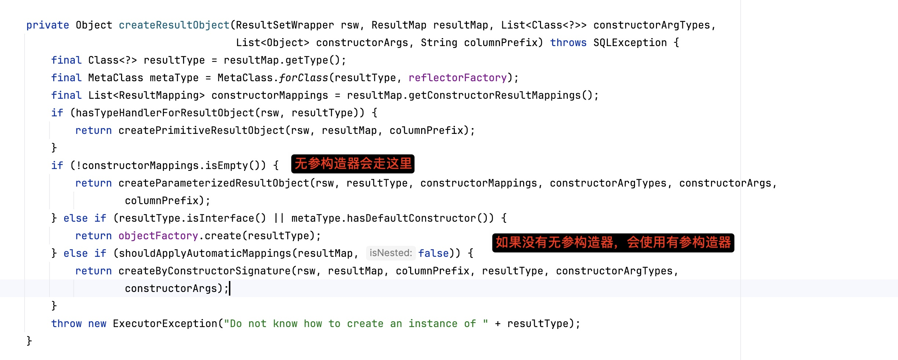
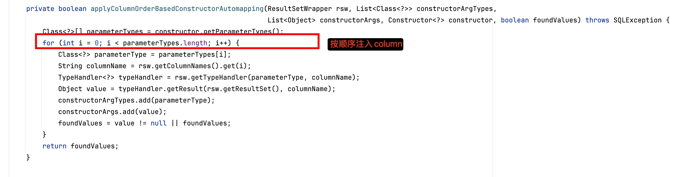

## 问题描述
在Mybatis-plus框架的BO中使用lomobo的@Builder注解时，使用mapper进行查询时，会报类型转换异常，比如明明是String类型的字段，查询时却报错说是Integer类型的字段。
## 问题原因
@Builder注解会生成一个有参构造器，而原来的JavaBean中的无参构造器被覆盖了。
Mybatis-plus在查询时会默认使用无参构造器来创建对象，将对象实例化之后再通过字段名注入。
**但是如果没有无参构造器，就会使用有参构造器否则将无法实例化，并且按照字段顺序遍历进行注入，比如发生将String插入Integer，就会导致类型转换异常。**
总结下来，个人感觉这里应该有个Warn，提示一下，Mybatis-plus在查询时需要无参构造器。否则单纯的按顺序遍历有种硬着头皮上的感觉。
### 如下图

## 解决方案
使用lombok的@NoArgsConstructor注解来生成无参构造器，这样Mybatis-plus就可以正常查询了。

